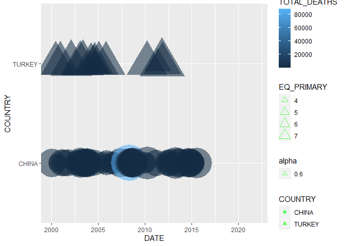

<!-- README.md is generated from README.Rmd. Please edit that file -->

# eqvis

<!-- badges: start -->

[](https://travis-ci.com/akbarpunjwani/msdr-capstone-eqvis)
<!-- badges: end -->

The goal of EQVIS is to provide EarthQuake VISualization tools in order
to analyze the earthquakes occurrences as reported at NOAA sample data
set as available for public access.

## Installation

You can install the released version of eqvis from
[CRAN](https://CRAN.R-project.org) with:

``` r
library(devtools)
install_github("akbarpunjwani/msdr-capstone-eqvis")
library(eqvis)
```

The EQVIS, which stands for EarthQuake VISualizations, provide a sample
data set for public access to analyze the earthquakes occurrences as
reported at
[NOAA](https://www.ngdc.noaa.gov/nndc/struts/form?t=101650&s=1&d=1).

This package includes this data for internal use only. However, this
package uses that data and provides a **geometric objects**
(*eq\_timeline\_and\_labels*) and the **mapping based visual plots**
(*eq\_map\_with\_datelabels and eq\_map\_with\_htmllabels*) for
specified year.

## Data Summary

The NOAA Earthquakes data has a time series information of DAY, MONTH
and YEAR of the earthquakes along with the spatial information of
Longitude, Latitude & Location. Additionally, it also has the data of eq
magnitude & total deaths. In order to load & clean data, below methods
can be used:

**eq\_load\_data(filename)** Since the package includes the dataset of
NOAA for earthquakes, the output would be the raw data as loaded from
the archived file available with public access.

Examples: *eqvis::eq\_load\_data()*

``` r
eqvis::eq_load_data()
#> Warning: 5257 parsing failures.
#>  row        col           expected actual                                                                                                              file
#> 1064 SECOND     1/0/T/F/TRUE/FALSE    5.0 'C:/Users/Akbar.Punjwani/AppData/Local/Temp/RtmpyCYW7o/temp_libpath44183763489d/eqvis/extdata/earthquakes.tsv.gz'
#> 1243 SECOND     1/0/T/F/TRUE/FALSE   35.0 'C:/Users/Akbar.Punjwani/AppData/Local/Temp/RtmpyCYW7o/temp_libpath44183763489d/eqvis/extdata/earthquakes.tsv.gz'
#> 1482 EQ_MAG_MFA 1/0/T/F/TRUE/FALSE  7.2   'C:/Users/Akbar.Punjwani/AppData/Local/Temp/RtmpyCYW7o/temp_libpath44183763489d/eqvis/extdata/earthquakes.tsv.gz'
#> 1483 EQ_MAG_MFA 1/0/T/F/TRUE/FALSE  7     'C:/Users/Akbar.Punjwani/AppData/Local/Temp/RtmpyCYW7o/temp_libpath44183763489d/eqvis/extdata/earthquakes.tsv.gz'
#> 1484 EQ_MAG_MFA 1/0/T/F/TRUE/FALSE  7.1   'C:/Users/Akbar.Punjwani/AppData/Local/Temp/RtmpyCYW7o/temp_libpath44183763489d/eqvis/extdata/earthquakes.tsv.gz'
#> .... .......... .................. ...... .................................................................................................................
#> See problems(...) for more details.
#> Warning: `tbl_df()` is deprecated as of dplyr 1.0.0.
#> Please use `tibble::as_tibble()` instead.
#> This warning is displayed once every 8 hours.
#> Call `lifecycle::last_warnings()` to see where this warning was generated.
#> # A tibble: 5,937 x 47
#>      I_D FLAG_TSUNAMI  YEAR MONTH   DAY  HOUR MINUTE SECOND FOCAL_DEPTH
#>    <dbl> <chr>        <dbl> <dbl> <dbl> <dbl>  <dbl> <lgl>        <dbl>
#>  1     1 <NA>         -2150    NA    NA    NA     NA NA              NA
#>  2     3 <NA>         -2000    NA    NA    NA     NA NA              18
#>  3     2 Tsu          -2000    NA    NA    NA     NA NA              NA
#>  4  5877 Tsu          -1610    NA    NA    NA     NA NA              NA
#>  5     8 <NA>         -1566    NA    NA    NA     NA NA              NA
#>  6    11 <NA>         -1450    NA    NA    NA     NA NA              NA
#>  7  9712 Tsu          -1365    NA    NA    NA     NA NA              NA
#>  8    12 <NA>         -1250    NA    NA    NA     NA NA              NA
#>  9    13 <NA>         -1050    NA    NA    NA     NA NA              NA
#> 10    14 <NA>          -759    NA    NA    NA     NA NA              NA
#> # ... with 5,927 more rows, and 38 more variables: EQ_PRIMARY <chr>,
#> #   EQ_MAG_MW <chr>, EQ_MAG_MS <chr>, EQ_MAG_MB <lgl>, EQ_MAG_ML <dbl>,
#> #   EQ_MAG_MFA <lgl>, EQ_MAG_UNK <chr>, INTENSITY <dbl>, COUNTRY <chr>,
#> #   STATE <chr>, LOCATION_NAME <chr>, LATITUDE <chr>, LONGITUDE <chr>,
#> #   REGION_CODE <dbl>, DEATHS <chr>, DEATHS_DESCRIPTION <dbl>, MISSING <lgl>,
#> #   MISSING_DESCRIPTION <dbl>, INJURIES <chr>, INJURIES_DESCRIPTION <dbl>,
#> #   DAMAGE_MILLIONS_DOLLARS <lgl>, DAMAGE_DESCRIPTION <dbl>,
#> #   HOUSES_DESTROYED <dbl>, HOUSES_DESTROYED_DESCRIPTION <dbl>,
#> #   HOUSES_DAMAGED <dbl>, HOUSES_DAMAGED_DESCRIPTION <dbl>, TOTAL_DEATHS <chr>,
#> #   TOTAL_DEATHS_DESCRIPTION <dbl>, TOTAL_MISSING <lgl>,
#> #   TOTAL_MISSING_DESCRIPTION <lgl>, TOTAL_INJURIES <dbl>,
#> #   TOTAL_INJURIES_DESCRIPTION <dbl>, TOTAL_DAMAGE_MILLIONS_DOLLARS <lgl>,
#> #   TOTAL_DAMAGE_DESCRIPTION <dbl>, TOTAL_HOUSES_DESTROYED <dbl>,
#> #   TOTAL_HOUSES_DESTROYED_DESCRIPTION <dbl>, TOTAL_HOUSES_DAMAGED <dbl>,
#> #   TOTAL_HOUSES_DAMAGED_DESCRIPTION <dbl>
```

*eqvis::eq\_location\_clean()*

``` r
eqvis::eq_location_clean()
#> Warning: 5257 parsing failures.
#>  row        col           expected actual                                                                                                              file
#> 1064 SECOND     1/0/T/F/TRUE/FALSE    5.0 'C:/Users/Akbar.Punjwani/AppData/Local/Temp/RtmpyCYW7o/temp_libpath44183763489d/eqvis/extdata/earthquakes.tsv.gz'
#> 1243 SECOND     1/0/T/F/TRUE/FALSE   35.0 'C:/Users/Akbar.Punjwani/AppData/Local/Temp/RtmpyCYW7o/temp_libpath44183763489d/eqvis/extdata/earthquakes.tsv.gz'
#> 1482 EQ_MAG_MFA 1/0/T/F/TRUE/FALSE  7.2   'C:/Users/Akbar.Punjwani/AppData/Local/Temp/RtmpyCYW7o/temp_libpath44183763489d/eqvis/extdata/earthquakes.tsv.gz'
#> 1483 EQ_MAG_MFA 1/0/T/F/TRUE/FALSE  7     'C:/Users/Akbar.Punjwani/AppData/Local/Temp/RtmpyCYW7o/temp_libpath44183763489d/eqvis/extdata/earthquakes.tsv.gz'
#> 1484 EQ_MAG_MFA 1/0/T/F/TRUE/FALSE  7.1   'C:/Users/Akbar.Punjwani/AppData/Local/Temp/RtmpyCYW7o/temp_libpath44183763489d/eqvis/extdata/earthquakes.tsv.gz'
#> .... .......... .................. ...... .................................................................................................................
#> See problems(...) for more details.
#> Warning: Expected 4 pieces. Missing pieces filled with `NA` in 5888 rows [1, 2,
#> 3, 4, 5, 6, 7, 8, 9, 10, 11, 12, 13, 14, 15, 16, 17, 18, 19, 20, ...].
#> # A tibble: 5,937 x 47
#>      I_D FLAG_TSUNAMI  YEAR MONTH   DAY  HOUR MINUTE SECOND FOCAL_DEPTH
#>    <dbl> <chr>        <dbl> <dbl> <dbl> <dbl>  <dbl> <lgl>        <dbl>
#>  1     1 <NA>         -2150    NA    NA    NA     NA NA              NA
#>  2     3 <NA>         -2000    NA    NA    NA     NA NA              18
#>  3     2 Tsu          -2000    NA    NA    NA     NA NA              NA
#>  4  5877 Tsu          -1610    NA    NA    NA     NA NA              NA
#>  5     8 <NA>         -1566    NA    NA    NA     NA NA              NA
#>  6    11 <NA>         -1450    NA    NA    NA     NA NA              NA
#>  7  9712 Tsu          -1365    NA    NA    NA     NA NA              NA
#>  8    12 <NA>         -1250    NA    NA    NA     NA NA              NA
#>  9    13 <NA>         -1050    NA    NA    NA     NA NA              NA
#> 10    14 <NA>          -759    NA    NA    NA     NA NA              NA
#> # ... with 5,927 more rows, and 38 more variables: EQ_PRIMARY <chr>,
#> #   EQ_MAG_MW <chr>, EQ_MAG_MS <chr>, EQ_MAG_MB <lgl>, EQ_MAG_ML <dbl>,
#> #   EQ_MAG_MFA <lgl>, EQ_MAG_UNK <chr>, INTENSITY <dbl>, STATE <chr>,
#> #   LATITUDE <chr>, COUNTRY <fct>, LONGITUDE <chr>, REGION_CODE <dbl>,
#> #   DEATHS <chr>, DEATHS_DESCRIPTION <dbl>, MISSING <lgl>,
#> #   MISSING_DESCRIPTION <dbl>, INJURIES <chr>, INJURIES_DESCRIPTION <dbl>,
#> #   DAMAGE_MILLIONS_DOLLARS <lgl>, DAMAGE_DESCRIPTION <dbl>,
#> #   HOUSES_DESTROYED <dbl>, HOUSES_DESTROYED_DESCRIPTION <dbl>,
#> #   HOUSES_DAMAGED <dbl>, HOUSES_DAMAGED_DESCRIPTION <dbl>, TOTAL_DEATHS <chr>,
#> #   TOTAL_DEATHS_DESCRIPTION <dbl>, TOTAL_MISSING <lgl>,
#> #   TOTAL_MISSING_DESCRIPTION <lgl>, TOTAL_INJURIES <dbl>,
#> #   TOTAL_INJURIES_DESCRIPTION <dbl>, TOTAL_DAMAGE_MILLIONS_DOLLARS <lgl>,
#> #   TOTAL_DAMAGE_DESCRIPTION <dbl>, TOTAL_HOUSES_DESTROYED <dbl>,
#> #   TOTAL_HOUSES_DESTROYED_DESCRIPTION <dbl>, TOTAL_HOUSES_DAMAGED <dbl>,
#> #   TOTAL_HOUSES_DAMAGED_DESCRIPTION <dbl>, LOCATION_NAME <chr>
```

*eqvis::eq\_clean\_data()* (Internally loads raw data when no data is
passed)

``` r
eqvis::eq_clean_data()
#> Warning: 5257 parsing failures.
#>  row        col           expected actual                                                                                                              file
#> 1064 SECOND     1/0/T/F/TRUE/FALSE    5.0 'C:/Users/Akbar.Punjwani/AppData/Local/Temp/RtmpyCYW7o/temp_libpath44183763489d/eqvis/extdata/earthquakes.tsv.gz'
#> 1243 SECOND     1/0/T/F/TRUE/FALSE   35.0 'C:/Users/Akbar.Punjwani/AppData/Local/Temp/RtmpyCYW7o/temp_libpath44183763489d/eqvis/extdata/earthquakes.tsv.gz'
#> 1482 EQ_MAG_MFA 1/0/T/F/TRUE/FALSE  7.2   'C:/Users/Akbar.Punjwani/AppData/Local/Temp/RtmpyCYW7o/temp_libpath44183763489d/eqvis/extdata/earthquakes.tsv.gz'
#> 1483 EQ_MAG_MFA 1/0/T/F/TRUE/FALSE  7     'C:/Users/Akbar.Punjwani/AppData/Local/Temp/RtmpyCYW7o/temp_libpath44183763489d/eqvis/extdata/earthquakes.tsv.gz'
#> 1484 EQ_MAG_MFA 1/0/T/F/TRUE/FALSE  7.1   'C:/Users/Akbar.Punjwani/AppData/Local/Temp/RtmpyCYW7o/temp_libpath44183763489d/eqvis/extdata/earthquakes.tsv.gz'
#> .... .......... .................. ...... .................................................................................................................
#> See problems(...) for more details.
#> Warning: Expected 4 pieces. Missing pieces filled with `NA` in 5888 rows [1, 2,
#> 3, 4, 5, 6, 7, 8, 9, 10, 11, 12, 13, 14, 15, 16, 17, 18, 19, 20, ...].
#> Warning: 18 failed to parse.
#> # A tibble: 5,937 x 12
#>    DATE        YEAR MONTH   DAY LATITUDE LONGITUDE COUNTRY LOCATION_NAME
#>    <date>     <dbl> <dbl> <dbl>    <dbl>     <dbl> <fct>   <chr>        
#>  1 2150-01-01 -2150    NA    NA     31.1      35.5 JORDAN  "Bab-A-Daraa~
#>  2 2000-01-01 -2000    NA    NA     38        58.2 TURKME~ "W"          
#>  3 2000-01-01 -2000    NA    NA     35.7      35.8 SYRIA   "Ugarit"     
#>  4 1610-01-01 -1610    NA    NA     36.4      25.4 GREECE  "Thera Islan~
#>  5 1566-01-01 -1566    NA    NA     31.5      35.3 ISRAEL  "Ariha (Jeri~
#>  6 1450-01-01 -1450    NA    NA     35.5      25.5 ITALY   "Lacus Cimin~
#>  7 1365-01-01 -1365    NA    NA     35.7      35.8 SYRIAN~ ""           
#>  8 1250-01-01 -1250    NA    NA     32        35.5 ISRAEL  "Ariha (Jeri~
#>  9 1050-01-01 -1050    NA    NA     29.6      35   JORDAN  "Sw:  Timna ~
#> 10 7590-10-01  -759    NA    NA     33        35.5 ISRAEL  "Jerusalem"  
#> # ... with 5,927 more rows, and 4 more variables: INTENSITY <dbl>,
#> #   TOTAL_DEATHS <int>, EQ_PRIMARY <dbl>, EQ_MAG_MW <dbl>
```

## Data Visualization

The NOAA Earthquake data contains details (DATE, MAGNITUDE, TOTAL
DEATHS, LOCATION) of world-wide occurrences of earthquakes. The package
uses this data to visualize it into a timeline plot for each country,
using the below mentioned method:

**eqvis::eq\_timeline()**

As the package includes the dataset of NOAA earthquakes, this method
helps the user to visualize the data for the selected countries, time
series range & magnitude. In case any of the required details not
provided, it provides the sample output for specific values.

Examples: *eqvis::eq\_timeline(countries = c(‘TURKEY’,‘CHINA’))*

``` r
grid::grid.draw(eqvis::eq_timeline(countries = c('TURKEY','CHINA')))
#> Warning: 5257 parsing failures.
#>  row        col           expected actual                                                                                                              file
#> 1064 SECOND     1/0/T/F/TRUE/FALSE    5.0 'C:/Users/Akbar.Punjwani/AppData/Local/Temp/RtmpyCYW7o/temp_libpath44183763489d/eqvis/extdata/earthquakes.tsv.gz'
#> 1243 SECOND     1/0/T/F/TRUE/FALSE   35.0 'C:/Users/Akbar.Punjwani/AppData/Local/Temp/RtmpyCYW7o/temp_libpath44183763489d/eqvis/extdata/earthquakes.tsv.gz'
#> 1482 EQ_MAG_MFA 1/0/T/F/TRUE/FALSE  7.2   'C:/Users/Akbar.Punjwani/AppData/Local/Temp/RtmpyCYW7o/temp_libpath44183763489d/eqvis/extdata/earthquakes.tsv.gz'
#> 1483 EQ_MAG_MFA 1/0/T/F/TRUE/FALSE  7     'C:/Users/Akbar.Punjwani/AppData/Local/Temp/RtmpyCYW7o/temp_libpath44183763489d/eqvis/extdata/earthquakes.tsv.gz'
#> 1484 EQ_MAG_MFA 1/0/T/F/TRUE/FALSE  7.1   'C:/Users/Akbar.Punjwani/AppData/Local/Temp/RtmpyCYW7o/temp_libpath44183763489d/eqvis/extdata/earthquakes.tsv.gz'
#> .... .......... .................. ...... .................................................................................................................
#> See problems(...) for more details.
#> Warning: Expected 4 pieces. Missing pieces filled with `NA` in 5888 rows [1, 2,
#> 3, 4, 5, 6, 7, 8, 9, 10, 11, 12, 13, 14, 15, 16, 17, 18, 19, 20, ...].
#> Warning: 18 failed to parse.
#> Warning: Removed 432 rows containing non-finite values (stat_timeline).
```



**eqvis::eq\_timeline\_and\_labels()**

This method helps the user to visualize the largest earthquakes
locations in addition to the time series range & magnitude. In case any
of the parameters is not provided with values, it displays the sample
with example values.

Examples: *eqvis::eq\_timeline\_and\_labels(countries =
c(‘TURKEY’,‘CHINA’))*

``` r
grid::grid.draw(eqvis::eq_timeline_and_labels(countries = c('TURKEY','CHINA')))
#> Warning: 5257 parsing failures.
#>  row        col           expected actual                                                                                                              file
#> 1064 SECOND     1/0/T/F/TRUE/FALSE    5.0 'C:/Users/Akbar.Punjwani/AppData/Local/Temp/RtmpyCYW7o/temp_libpath44183763489d/eqvis/extdata/earthquakes.tsv.gz'
#> 1243 SECOND     1/0/T/F/TRUE/FALSE   35.0 'C:/Users/Akbar.Punjwani/AppData/Local/Temp/RtmpyCYW7o/temp_libpath44183763489d/eqvis/extdata/earthquakes.tsv.gz'
#> 1482 EQ_MAG_MFA 1/0/T/F/TRUE/FALSE  7.2   'C:/Users/Akbar.Punjwani/AppData/Local/Temp/RtmpyCYW7o/temp_libpath44183763489d/eqvis/extdata/earthquakes.tsv.gz'
#> 1483 EQ_MAG_MFA 1/0/T/F/TRUE/FALSE  7     'C:/Users/Akbar.Punjwani/AppData/Local/Temp/RtmpyCYW7o/temp_libpath44183763489d/eqvis/extdata/earthquakes.tsv.gz'
#> 1484 EQ_MAG_MFA 1/0/T/F/TRUE/FALSE  7.1   'C:/Users/Akbar.Punjwani/AppData/Local/Temp/RtmpyCYW7o/temp_libpath44183763489d/eqvis/extdata/earthquakes.tsv.gz'
#> .... .......... .................. ...... .................................................................................................................
#> See problems(...) for more details.
#> Warning: Expected 4 pieces. Missing pieces filled with `NA` in 5888 rows [1, 2,
#> 3, 4, 5, 6, 7, 8, 9, 10, 11, 12, 13, 14, 15, 16, 17, 18, 19, 20, ...].
#> Warning: 18 failed to parse.
#> Warning: Removed 83 rows containing non-finite values (stat_timeline).
#> Warning: Removed 83 rows containing non-finite values (stat_timeline_label).
```


**eqvis::eq\_map\_with\_datelabels()**

As the package includes the dataset of NOAA earthquakes, this method
helps the user to get a interactive map of earthquakes along with popup
text showing date labels.

Examples: *eqvis::eq\_map\_with\_datelabels()*

``` r
eqvis::eq_map_with_datelabels()
#> Warning: 5257 parsing failures.
#>  row        col           expected actual                                                                                                              file
#> 1064 SECOND     1/0/T/F/TRUE/FALSE    5.0 'C:/Users/Akbar.Punjwani/AppData/Local/Temp/RtmpyCYW7o/temp_libpath44183763489d/eqvis/extdata/earthquakes.tsv.gz'
#> 1243 SECOND     1/0/T/F/TRUE/FALSE   35.0 'C:/Users/Akbar.Punjwani/AppData/Local/Temp/RtmpyCYW7o/temp_libpath44183763489d/eqvis/extdata/earthquakes.tsv.gz'
#> 1482 EQ_MAG_MFA 1/0/T/F/TRUE/FALSE  7.2   'C:/Users/Akbar.Punjwani/AppData/Local/Temp/RtmpyCYW7o/temp_libpath44183763489d/eqvis/extdata/earthquakes.tsv.gz'
#> 1483 EQ_MAG_MFA 1/0/T/F/TRUE/FALSE  7     'C:/Users/Akbar.Punjwani/AppData/Local/Temp/RtmpyCYW7o/temp_libpath44183763489d/eqvis/extdata/earthquakes.tsv.gz'
#> 1484 EQ_MAG_MFA 1/0/T/F/TRUE/FALSE  7.1   'C:/Users/Akbar.Punjwani/AppData/Local/Temp/RtmpyCYW7o/temp_libpath44183763489d/eqvis/extdata/earthquakes.tsv.gz'
#> .... .......... .................. ...... .................................................................................................................
#> See problems(...) for more details.
#> Warning: Expected 4 pieces. Missing pieces filled with `NA` in 5888 rows [1, 2,
#> 3, 4, 5, 6, 7, 8, 9, 10, 11, 12, 13, 14, 15, 16, 17, 18, 19, 20, ...].
#> Warning: 18 failed to parse.
#> PhantomJS not found. You can install it with webshot::install_phantomjs(). If it is installed, please make sure the phantomjs executable can be found via the PATH variable.
```

<div id="htmlwidget-5c94ef306d9569d5cb17" style="width:100%;height:480px;" class="leaflet html-widget"></div>
<script type="application/json" data-for="htmlwidget-5c94ef306d9569d5cb17">{"x":{"options":{"crs":{"crsClass":"L.CRS.EPSG3857","code":null,"proj4def":null,"projectedBounds":null,"options":{}}},"calls":[{"method":"addTiles","args":["//{s}.tile.openstreetmap.org/{z}/{x}/{y}.png",null,null,{"minZoom":0,"maxZoom":18,"tileSize":256,"subdomains":"abc","errorTileUrl":"","tms":false,"noWrap":false,"zoomOffset":0,"zoomReverse":false,"opacity":1,"zIndex":1,"detectRetina":false,"attribution":"&copy; <a href=\"http://openstreetmap.org\">OpenStreetMap<\/a> contributors, <a href=\"http://creativecommons.org/licenses/by-sa/2.0/\">CC-BY-SA<\/a>"}]},{"method":"addCircleMarkers","args":[[18.194,32.319,16.87,18.77,17.488,17.302,32.456,32.437,32.297,16.396,17.844,16.493,16.917,17.552,17.385,17.842],[-95.908,-115.322,-100.113,-104.104,-101.303,-100.198,-115.315,-115.165,-115.278,-97.782,-99.963,-98.231,-99.381,-100.816,-100.656,-95.524],[5.9,5.5,5.3,7.5,6.1,6,5.1,5.9,7.2,6.2,6.4,7.4,6.2,7.2,6.4,6.3],null,null,{"interactive":true,"className":"","stroke":true,"color":"#03F","weight":2,"opacity":0.5,"fill":true,"fillColor":"#03F","fillOpacity":0.1},null,null,["2002-01-30","2002-02-22","2002-09-25","2003-01-22","2004-01-01","2007-04-13","2008-02-09","2009-12-30","2010-04-04","2010-06-30","2011-12-11","2012-03-20","2013-08-21","2014-04-18","2014-05-08","2014-07-29"],null,null,{"interactive":false,"permanent":false,"direction":"auto","opacity":1,"offset":[0,0],"textsize":"10px","textOnly":false,"className":"","sticky":true},null]}],"limits":{"lat":[16.396,32.456],"lng":[-115.322,-95.524]}},"evals":[],"jsHooks":[]}</script>

**eqvis::eq\_map\_with\_htmllabels()**

When compared with eq\_map\_with\_datelabels, this function shows the
popup text having more details and formatted using HTML tags. Instead of
date, the popup text shows Clean Location, Magnitude & Total Deaths.

Examples: *eqvis::eq\_map\_with\_htmllabels()*

``` r
eqvis::eq_map_with_htmllabels()
#> Warning: 5257 parsing failures.
#>  row        col           expected actual                                                                                                              file
#> 1064 SECOND     1/0/T/F/TRUE/FALSE    5.0 'C:/Users/Akbar.Punjwani/AppData/Local/Temp/RtmpyCYW7o/temp_libpath44183763489d/eqvis/extdata/earthquakes.tsv.gz'
#> 1243 SECOND     1/0/T/F/TRUE/FALSE   35.0 'C:/Users/Akbar.Punjwani/AppData/Local/Temp/RtmpyCYW7o/temp_libpath44183763489d/eqvis/extdata/earthquakes.tsv.gz'
#> 1482 EQ_MAG_MFA 1/0/T/F/TRUE/FALSE  7.2   'C:/Users/Akbar.Punjwani/AppData/Local/Temp/RtmpyCYW7o/temp_libpath44183763489d/eqvis/extdata/earthquakes.tsv.gz'
#> 1483 EQ_MAG_MFA 1/0/T/F/TRUE/FALSE  7     'C:/Users/Akbar.Punjwani/AppData/Local/Temp/RtmpyCYW7o/temp_libpath44183763489d/eqvis/extdata/earthquakes.tsv.gz'
#> 1484 EQ_MAG_MFA 1/0/T/F/TRUE/FALSE  7.1   'C:/Users/Akbar.Punjwani/AppData/Local/Temp/RtmpyCYW7o/temp_libpath44183763489d/eqvis/extdata/earthquakes.tsv.gz'
#> .... .......... .................. ...... .................................................................................................................
#> See problems(...) for more details.
#> Warning: Expected 4 pieces. Missing pieces filled with `NA` in 5888 rows [1, 2,
#> 3, 4, 5, 6, 7, 8, 9, 10, 11, 12, 13, 14, 15, 16, 17, 18, 19, 20, ...].
#> Warning: 18 failed to parse.
```

<div id="htmlwidget-934c8894db9937dde1b4" style="width:100%;height:480px;" class="leaflet html-widget"></div>
<script type="application/json" data-for="htmlwidget-934c8894db9937dde1b4">{"x":{"options":{"crs":{"crsClass":"L.CRS.EPSG3857","code":null,"proj4def":null,"projectedBounds":null,"options":{}}},"calls":[{"method":"addTiles","args":["//{s}.tile.openstreetmap.org/{z}/{x}/{y}.png",null,null,{"minZoom":0,"maxZoom":18,"tileSize":256,"subdomains":"abc","errorTileUrl":"","tms":false,"noWrap":false,"zoomOffset":0,"zoomReverse":false,"opacity":1,"zIndex":1,"detectRetina":false,"attribution":"&copy; <a href=\"http://openstreetmap.org\">OpenStreetMap<\/a> contributors, <a href=\"http://creativecommons.org/licenses/by-sa/2.0/\">CC-BY-SA<\/a>"}]},{"method":"addCircleMarkers","args":[[18.194,32.319,16.87,18.77,17.488,17.302,32.456,32.437,32.297,16.396,17.844,16.493,16.917,17.552,17.385,17.842],[-95.908,-115.322,-100.113,-104.104,-101.303,-100.198,-115.315,-115.165,-115.278,-97.782,-99.963,-98.231,-99.381,-100.816,-100.656,-95.524],[5.9,5.5,5.3,7.5,6.1,6,5.1,5.9,7.2,6.2,6.4,7.4,6.2,7.2,6.4,6.3],null,null,{"interactive":true,"className":"","stroke":true,"color":"#03F","weight":2,"opacity":0.5,"fill":true,"fillColor":"#03F","fillOpacity":0.1},null,null,["<b>Location: <\/b>Veracruz:  San Andres Tuxtla, Tuxtepec:<br/><b>Magnitude: <\/b>5.9<br/>","<b>Location: <\/b>Mexicali, Baja California<br/><b>Magnitude: <\/b>5.5<br/>","<b>Location: <\/b>Acapulco<br/><b>Magnitude: <\/b>5.3<br/>","<b>Location: <\/b>Villa De Alvarez, Colima, Tecoman, Jalisco<br/><b>Magnitude: <\/b>7.5<br/><b>Total deaths: <\/b>29<br/>","<b>Location: <\/b>Guerrero, Mexico City<br/><b>Magnitude: <\/b>6.1<br/>","<b>Location: <\/b>Guerrero, Atoyac<br/><b>Magnitude: <\/b>6<br/>","<b>Location: <\/b>Baja California<br/><b>Magnitude: <\/b>5.1<br/>","<b>Location: <\/b>Mexicali<br/><b>Magnitude: <\/b>5.9<br/>","<b>Location: <\/b>Baja California<br/><b>Magnitude: <\/b>7.2<br/><b>Total deaths: <\/b>2<br/>","<b>Location: <\/b>San Andres Huaxpaltepec<br/><b>Magnitude: <\/b>6.2<br/><b>Total deaths: <\/b>1<br/>","<b>Location: <\/b>Guerrero<br/><b>Magnitude: <\/b>6.4<br/><b>Total deaths: <\/b>2<br/>","<b>Location: <\/b>Guerrero, Oaxaca<br/><b>Magnitude: <\/b>7.4<br/><b>Total deaths: <\/b>2<br/>","<b>Location: <\/b>Acapulco<br/><b>Magnitude: <\/b>6.2<br/>","<b>Location: <\/b>Guerrero; Mexico City<br/><b>Magnitude: <\/b>7.2<br/>","<b>Location: <\/b>Tecpan<br/><b>Magnitude: <\/b>6.4<br/>","<b>Location: <\/b>Oaxaca<br/><b>Magnitude: <\/b>6.3<br/><b>Total deaths: <\/b>1<br/>"],null,null,{"interactive":false,"permanent":false,"direction":"auto","opacity":1,"offset":[0,0],"textsize":"10px","textOnly":false,"className":"","sticky":true},null]}],"limits":{"lat":[16.396,32.456],"lng":[-115.322,-95.524]}},"evals":[],"jsHooks":[]}</script>
